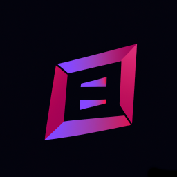

# Kakomimasu Meeting

このウェブアプリはDenoで作ったリアルタイムのコミュ二ケーションツールです。

Discordに似たUIでビデオ通話とチャットを利用することができます。

Organizationのメンバーだけが参加することができるので、GitHubでのグループ開発に便利です。

WebサーバはDeno DeployでデータベースはDeno KVでビデオ通話はSkyWayで動作します。

# 主な機能

- ビデオ通話
- テキストチャット
- ファイル共有
- ホワイトボード

# セットアップ方法

以下の環境変数を設定します。

- GITHUB_CLIENT_ID
- GITHUB_CLIENT_SECRET
- SKYWAY_ID
- SKYWAY_SECRET
- GITHUB_PERSONAL_SECRET

GitHubのDeveloper SettingsからOAuth Appを追加します。
https://github.com/organizations/xxxx/settings/applications

Client secretsを作成します。

Authorization callback URLを以下の通りに設定します。
https://xxxx.deno.dev/auth/oauth2callback

以下のリポジトリをフォークします。 https://github.com/kakomimasu/meeting Deno
Deployでリポジトリを選択してmain.tsを選択します。

GitHubのPersonal Access Tokenを作成します。 https://github.com/settings/tokens

Generate new token (classic) ExpirationをNo expirationに設定します。 Select
scopesをadmin:orgのread:orgに設定します。

SkyWayのIDとトークンは[こちら](https://skyway.ntt.com/ja/docs/user-guide/javascript-sdk/quickstart/#164)を参考に取得してください。

